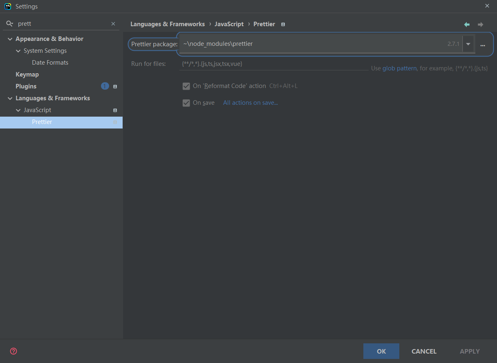

## 启动

```bash
# 默认会找 App.vue 文件
# vue serve App.vue
vue serve

# 如果缺少 vue-template-compiler
npm i -D vue-template-compiler
```


## 安装环境

```bash
# 富于表现力、动态的、健壮的 CSS
# -S 即--save（保存）
# -D 即--dev（开发）
# 最新版本可能存在冲突
yarn add stylus@0.54.8 stylus-loader@3.0.2 -D
```

## webstorm 配置 prettierrc

```bash
npm install --save-dev --save-exact prettier

yarn add --dev --exact prettier
```



项目中创建 .prettierrc 文件
```json
{
  "printWidth": 120,
  "bracketSpacing": true,
  "semi": false,
  "singleQuote": true
}
```


