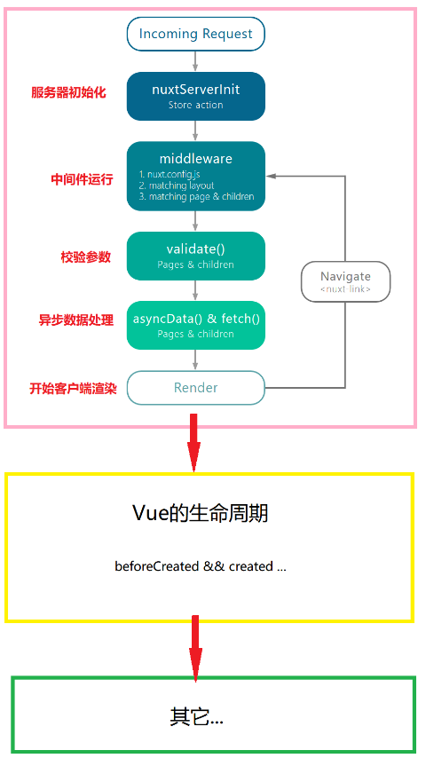

### Nuxt.js 应用一个完整的服务器请求到渲染（或用户通过 切换路由渲染页面）的流程：
1. nextServerInit 只在主模块中使用
2. nuxt.config.js 全局中间件
3. matching layout 不同布局的中间件
4. matching page & children 页面中间件
5. validate 返回false显示错误页面
6. asyncData 服务端渲染的页面数据请求
7. fetch 同步vuex数据

